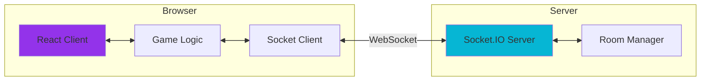

# 🎮 GameHub

> **Real-time multiplayer gaming platform for everyone**

### [🎯 Play Now](https://gamehub24.pages.dev)


## Star History

[](https://www.star-history.com/#HoangTran0410/gamehub24&type=date&legend=top-left)

---

## 📖 What is GameHub?

**GameHub** is a modern web platform that brings people together through **real-time multiplayer gaming**. Whether you're competing in chess, strategizing in board games, or just hanging out in a watch party, GameHub provides a seamless, beautiful experience.

Built with cutting-edge web technologies and designed with a stunning glassmorphic dark theme, GameHub delivers premium gaming experiences right in your browser—no downloads required.

---

## ✨ Highlights

- 🎮 **15+ Games** - Chess, Caro, Tic Tac Toe, UNO, Werewolf, Ludo, Connect 4, and more!
- 🤖 **Smart Bots** - Play solo with AI opponents (Minimax, Stockfish)
- 🌐 **Real-Time Multiplayer** - Powered by Socket.IO for instant synchronization
- 💬 **Live Chat** - Integrated chat in every room
- 🎨 **Premium UI** - Glassmorphism design with vibrant neon accents
- 📱 **Fully Responsive** - Seamless experience on desktop, tablet, and mobile
🏠 **Flexible Rooms** - Public rooms to meet players or private password-protected rooms for friends
👥 **Spectator Mode** - Watch games in progress

---

## 🏗️ Project Structure

```
gamehub/
├── client/          # React + TypeScript frontend
│   └── src/
│       └── games/   # Game implementations
│           └── README.md  📄 Game Architecture Guide
│
├── server/          # Socket.IO relay server
│   └── README.md    📄 Server Documentation
│
└── README.md        📄 This file (overview)
```

---

## 📚 Documentation

### 🎮 [Client Game Architecture →](./client/src/games/README.md)
**For developers creating new games**

Learn about:
- 🏗️ Game architecture and base classes
- 🔄 Host/Guest/Bot flow patterns
- 🔌 Socket communication
- 🛠️ Step-by-step guide to create new games
- 📋 Checklist and best practices

### 🌐 [Server Documentation →](./server/README.md)
**For backend/deployment setup**

Learn about:
- 🔌 Socket.IO event reference
- 🏠 Room management system
- 💬 Chat and relay architecture
- 🚀 Deployment guides
- 🐛 Debugging tips

---

## 🚀 Quick Start

### Prerequisites
- **Node.js** v18+
- **npm** or **bun**

### 1️⃣ Clone the Repository
```bash
git clone https://github.com/HoangTran0410/gamehub24.git
cd gamehub
```

### 2️⃣ Install Dependencies
```bash
# Install client dependencies
cd client
npm install

# Install server dependencies
cd ../server
npm install
```

### 3️⃣ Run Development Servers

**Terminal 1: Start Server**
```bash
cd server
npm run dev
# 🌐 Server running on http://localhost:3001
```

**Terminal 2: Start Client**
```bash
cd client
npm run dev
# 🎮 Client running on http://localhost:5173
```

### 4️⃣ Open Browser
```
http://localhost:5173
```

🎉 **You're ready to play!**

---

## 🎮 Featured Games

| Game | Players | Bot Support | Complexity |
|------|---------|-------------|------------|
| **Chess** ♟️ | 2 | ✅ Stockfish | ⭐⭐⭐ |
| **Caro (Gomoku)** 🔲 | 2 | ✅ Minimax | ⭐⭐ |
| **Werewolf** 🐺 | 5-12 | ✅ Multi-bot | ⭐⭐⭐ |
| **UNO** 🃏 | 2-4 | ✅ | ⭐⭐ |
| **Ludo** 🎲 | 2-4 | ✅ | ⭐⭐ |
| **Connect 4** 🔴 | 2 | ✅ | ⭐ |
| **Dots & Boxes** ⬛ | 2 | ❌ | ⭐⭐ |
| **Billiard** 🎱 | 2 | ❌ | ⭐⭐⭐ |
| **YouTube Party** 📺 | 1-100 | N/A | ⭐ |
| ...and more! | | | |

---

## 🛠️ Tech Stack

| Layer | Technologies |
|-------|-------------|
| **Frontend** | React 19, TypeScript, Vite, Tailwind CSS 4 |
| **State** | Zustand |
| **Real-time** | Socket.IO Client |
| **Backend** | Node.js, Express, Socket.IO Server |
| **Game Engines** | Stockfish.js (Chess), Minimax (TicTacToe, Caro) |
| **Routing** | React Router (HashRouter) |
| **Icons** | Lucide React |

---

## 🌐 Architecture Overview



**Key Concepts:**
- 🎮 **Client-Authoritative**: Game logic runs on the client (host)
- 🔄 **Pure Relay Server**: Server only relays events, no game validation
- 👑 **Host as Authority**: Room creator manages game state
- 👥 **Guest Receives State**: Guests sync state from host

📖 **Learn more**: [Game Architecture Guide](./client/src/games/README.md)

---

## 📦 Deployment

### Frontend (Cloudflare Pages / Vercel / Netlify)
```bash
cd client
npm run build
# Deploy the 'built/' folder
```

**Compatibility**: Uses HashRouter for subdirectory deployments (e.g., GitHub Pages)

### Backend (Railway / Render / Fly.io)
```bash
cd server
npm run build
npm start
```

**Required Environment Variables:**
```env
PORT=3001
CLIENT_URL=https://your-frontend-url.com
NODE_ENV=production
```

📖 **Learn more**: [Server Deployment Guide](./server/README.md)

---

## 🤝 Contributing

We welcome contributions from the community!

### How to Contribute
1. 🍴 Fork the repository
2. 🌱 Create a feature branch (`git checkout -b feature/AmazingFeature`)
3. ✅ Commit your changes (`git commit -m 'Add AmazingFeature'`)
4. 📤 Push to your branch (`git push origin feature/AmazingFeature`)
5. 🎉 Open a Pull Request

### Development Guidelines
- Follow existing code style (TypeScript, ESLint)
- Write descriptive commit messages
- Test your changes thoroughly
- Update documentation if needed

### Creating New Games
See the [Game Architecture Guide](./client/src/games/README.md) for a complete tutorial on adding new games to GameHub!

---

## 📄 License

Distributed under the **MIT License**. See `LICENSE` for more information.

---

## 🙏 Acknowledgments

- [Socket.IO](https://socket.io/) - Real-time engine
- [Stockfish.js](https://github.com/nmrugg/stockfish.js) - Chess AI
- [chess.js](https://github.com/jhlywa/chess.js) - Chess logic
- [Tailwind CSS](https://tailwindcss.com/) - Styling
- [Lucide](https://lucide.dev/) - Icons
- All our awesome contributors! ❤️

---

<div align="center">

### 🌟 Star this project if you like it!

**Built with ❤️ by [Hoang Tran](https://github.com/HoangTran0410)**

[🎮 Play Now](https://gamehub24.pages.dev) • [📖 Documentation](#-documentation) • [🐛 Report Bug](https://github.com/HoangTran0410/gamehub24/issues)

</div>
