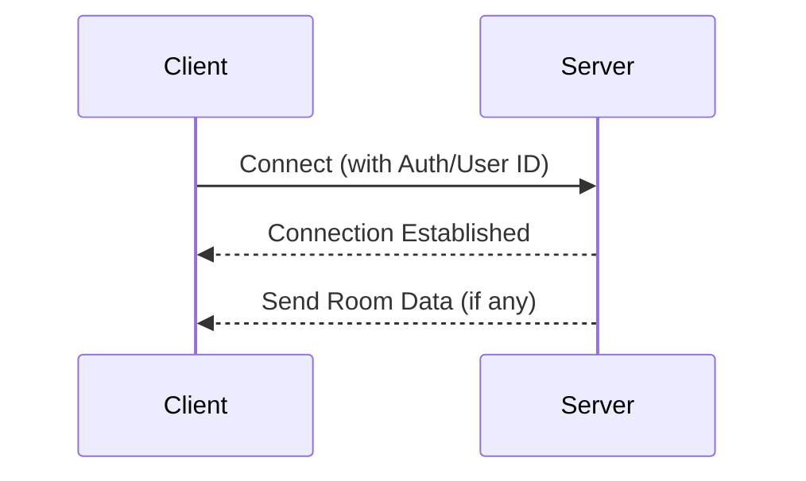
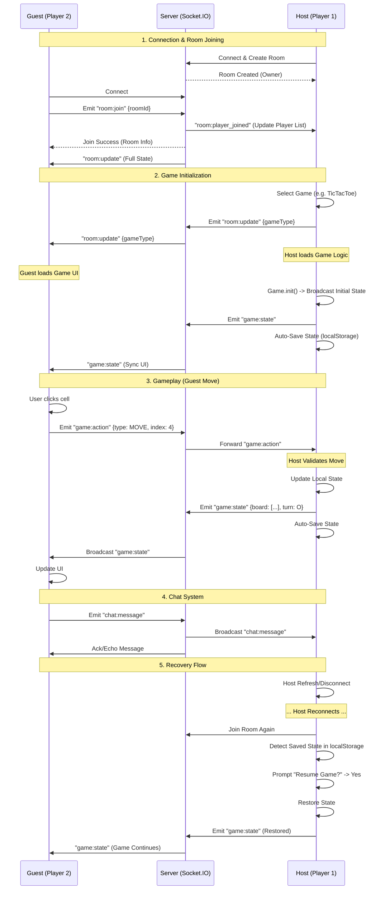

# GameHub24 Client

The client-side application for GameHub24, built with React and TypeScript.

## 1. Socket Connection

The application uses `socket.io-client` to communicate with the server.

*   **Initialization**: The socket connection is established in `src/services/socket.ts`. It tries to connect to the server URL stored in `localStorage` (defaulting to the production server).
*   **Events**: Global events like room updates, chat messages, and player changes are handled in `src/pages/Room.tsx`. Game-specific events are handled within each game class (extending `BaseGame`).

## 2. Settings & Configuration

The **Settings Modal** (`src/components/SettingsModal.tsx`) allows users to configure their experience:

*   **Server URL**: Users can change the backend server URL. This is useful for local development (`http://localhost:3001`) or switching between environments.
*   **Language**: Toggles between English (US) and Vietnamese (VN).
*   **Identity**:
    *   **User ID & Username**: Generated randomly and stored in `localStorage` (`user-storage`).
    *   **Regenerate Identity**: Users can click "Generate New Identity" to reset their ID and username. This essentially creates a "new user" from the server's perspective.
*   **Connection Status**: Displays whether the client is currently connected to the Socket.IO server.

## 3. Game Synchronization Mechanism

The game features a **Host-Client** architecture to ensure consistency and security (to some extent).

### Host Authority
*   The **Host** (Room Owner) is the source of truth for the game state.
*   Game logic (rules, win conditions, bot moves) runs primarily on the Host's client.
*   **Actions**: When a player (Host or Guest) makes a move, an action is sent via socket.
    *   If Host acts: It executes immediately and broadcasts the new state.
    *   If Guest acts: The action is sent to the Host via the Server. The Host validates it, executes it, and then broadcasts the updated state to all clients.

### State Persistence & Recovery (New)
To prevent data loss if the Host disconnects:
1.  **Auto-Save**: The Host automatically saves the game state to `localStorage` (`saved_game_[gameID]`) every time the state is broadcasted.
2.  **Recovery**: When the Host rejoins the room (or creates a new room with the same game type), the system detects the saved state.
3.  **Resume**: The Host is prompted to "Resume Game". If confirmed, the saved state is loaded, players are synchronized, and the game continues where it left off.

### Adding New Games
See [src/games/README.md](src/games/README.md) for a detailed guide on creating and registering new games.
