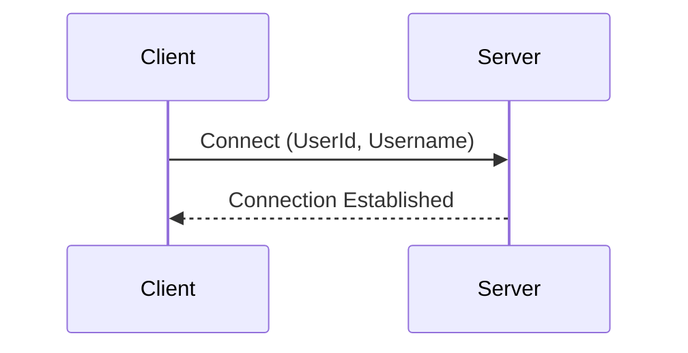
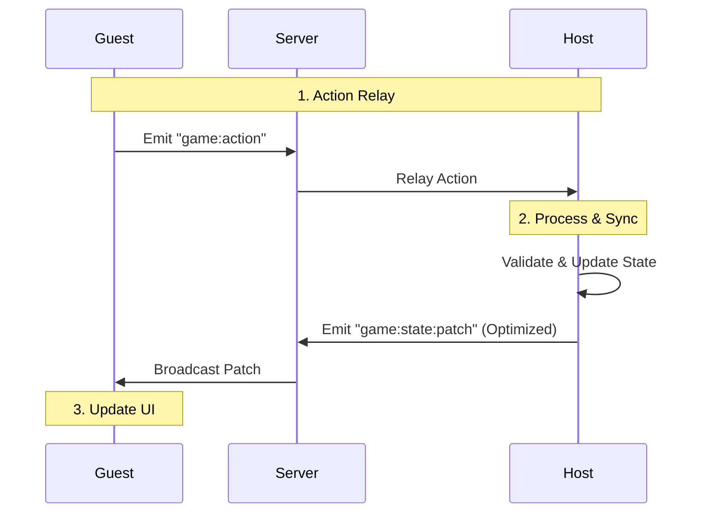

# GameHub24 Client

Frontend xây dựng bằng React + TypeScript + Bun.

## 1. Kết Nối / Connection
Sử dụng `socket.io-client`. Thông tin kết nối và danh tính (User ID, Username) được lưu trong `localStorage`.


*Bạn có thể đổi server URL hoặc tạo danh tính mới trong phần **Settings**.*

---

## 2. Đồng Bộ Game / Game Synchronization
Kiến trúc **Host-Guest** (Host đóng vai trò Server xử lý logic).



### Điểm Nổi Bật / Key Features:
- **Optimization**: Tự động gộp Patch (Compaction) và chỉ gửi thay đổi nhỏ nhất để tiết kiệm băng thông.
- **Structural Sharing**: Sử dụng Immer giúp React re-render cực nhanh và chính xác.
- **Persistence**: Host tự động lưu state vào `localStorage`. Nếu bị mất kết nối, Host có thể Resume game ngay lập tức.

---

## ⚙️ Cài Đặt / Development
```bash
# Cài đặt
bun install

# Chạy Dev
bun run dev

# Build
bun run build
```

Xem thêm [src/games/README.md](src/games/README.md) để biết cách tạo game mới.
