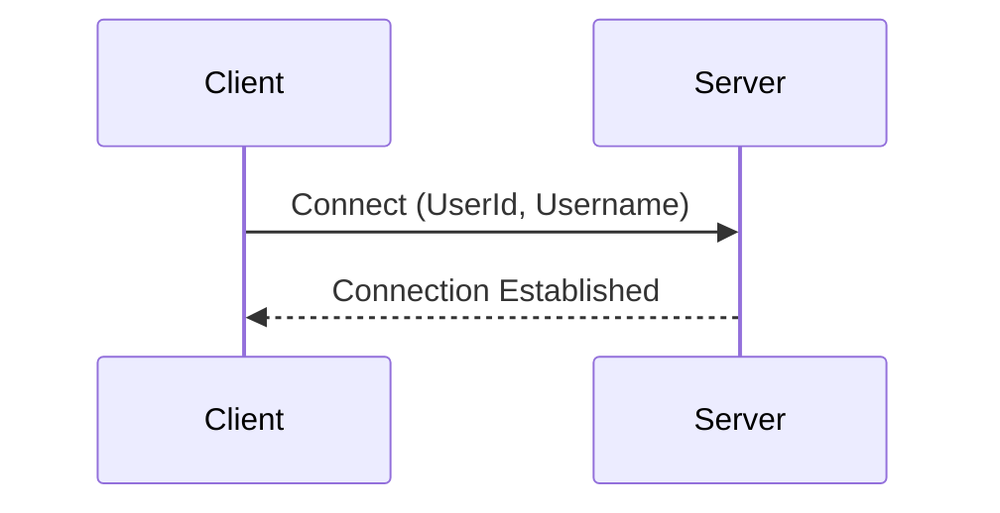
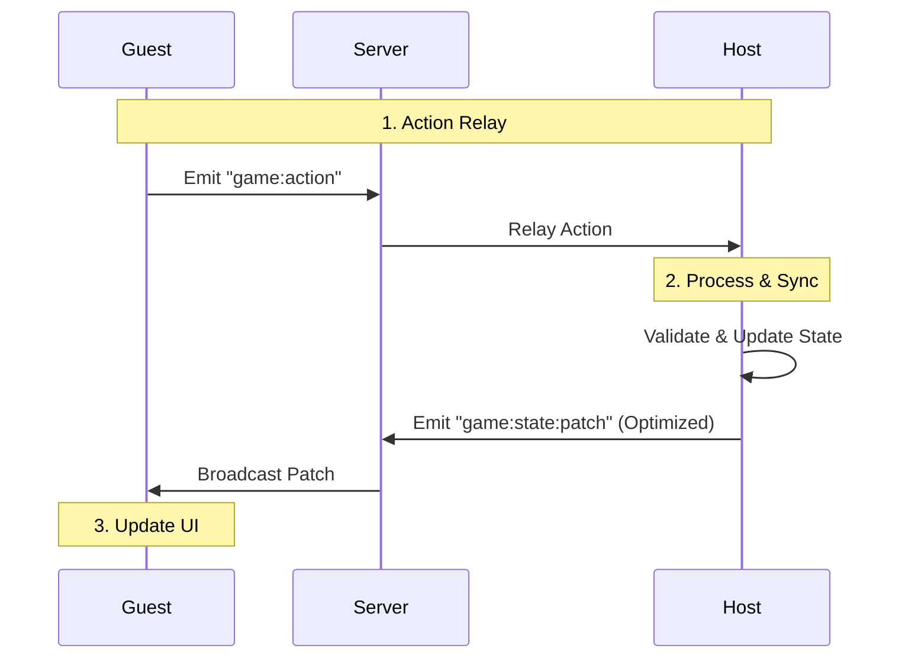

# GameHub Client

Frontend built with React + TypeScript + Vite.

## Connection

Uses `socket.io-client` for real-time communication. Connection info and identity (User ID, Username) are stored in `localStorage`.



You can change the server URL or create a new identity in **Settings**.

---

## Game Synchronization

The platform uses a **Host-Guest** architecture where the Host acts as the game server and processes all logic.



### Key Features

- **Optimization**: Automatic patch compaction - only the smallest necessary changes are sent to save bandwidth
- **Structural Sharing**: Uses Immer for fast and accurate React re-renders
- **Persistence**: Host automatically saves state to `localStorage`. If disconnected, the Host can resume the game immediately

---

## Development

```bash
# Install dependencies
bun install

# Start development server
bun run dev

# Build for production
bun run build

# Lint code
bun run lint
```

See [src/games/README.md](src/games/README.md) for instructions on creating new games.
