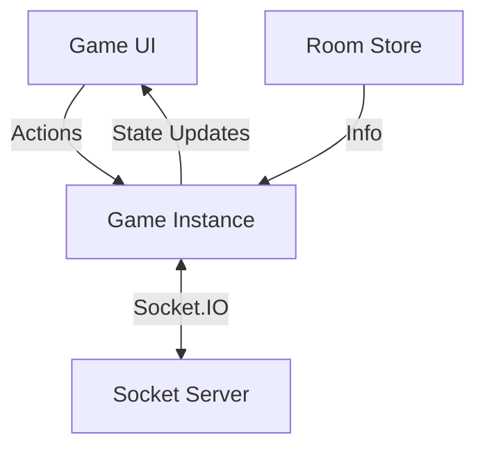

# Game Architecture Documentation

## 📖 Tổng Quan / Overview
Kiến trúc **client-authoritative** với **host-as-server**:
- **Host**: Server xử lý logic, validate actions, quản lý Bot và đồng bộ state.
- **Guest**: Nhận state patches/updates từ host và render UI.
- **BaseGame**: Core framework quản lý đồng bộ và state.

---

## 🏗️ Kiến Trúc / Architecture

### 1. Thành Phần / Components


### 2. BaseGame Deep Dive 🔍

#### A. State & Reactivity
`BaseGame` dùng **Immer** & **Proxy** để quản lý state:
- **Proxy Tracking**: Mutate trực tiếp (`state.x++`) tự động ghi lại Patch.
- **Immutable Snapshot**: `useGameState` cung cấp snapshot không thể thay đổi (`lastSnapshot`).
- **React Optimization**: Mỗi khi update, `BaseGame` ép tạo reference mới cho snapshot để React re-render tin cậy 100%.

#### B. Synchronization Optimization 🚀
Cơ chế đồng bộ 3 lớp giúp tối ưu băng thông:
1. **Patch Compaction (New)**: Các thay đổi được gom vào một `Map`. Nếu một `path` bị đổi nhiều lần (vd: di chuyển), chỉ giá trị cuối cùng được giữ lại.
2. **Incremental Patching**: Chỉ gửi các phần thay đổi (Patch) qua `game:state:patch`.
3. **Full Sync**: Gửi toàn bộ state khi có người mới vào hoặc lỗi đồng bộ.

---

## 🛠️ Tạo Game Mới / Quick Start

### 1. Files Structure
- `MyGame.ts`: Kế thừa `BaseGame<T>`, implement `getInitState` và `onSocketGameAction`.
- `MyGameUI.tsx`: Dùng `const [state] = useGameState(game)` để lấy state.
- `types.ts`: Định nghĩa `State` và `Action`.

### 2. Implementation Guide
```typescript
// MyGame.ts
export default class MyGame extends BaseGame<MyGameState> {
  getInitState() { return { score: 0 }; }
  onSocketGameAction({ action }) {
    if (!this.isHost) return;
    if (action.type === 'ADD') this.state.score++;
  }
}
```

---

## 💡 Best Practices

1. **Host-Only Logic**: Tính điểm, thắng thua chỉ nên viết ở class Game (chạy trên Host). UI chỉ gửi action.
2. **Deterministic State**: State chỉ chứa data (object, array, primitive). Không lưu class/function.
3. **Always Mutate**: Không gán lại `this.state = ...`, hãy mutate trực tiếp hoặc `Object.assign` để Proxy hoạt động.
4. **Persistence**: Gọi `this.setGameName("name")` để tự động lưu/load game khi refresh trang.
5. **Bot AI & Side Effects**: Hạn chế dùng `setTimeout` rời rạc. Nếu cần trì hoãn hành động của Bot, phải quản lý timer chặt chẽ và luôn dọn dẹp (clear) trong hàm `destroy()` để tránh memory leak hoặc lỗi khi nhảy sang game mới.
