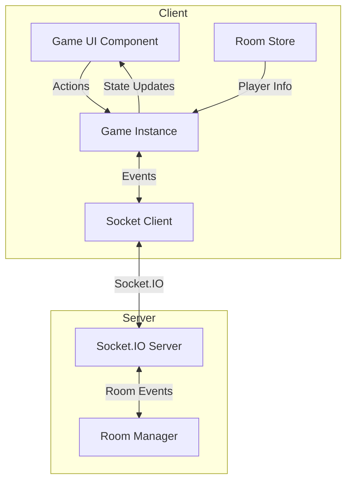
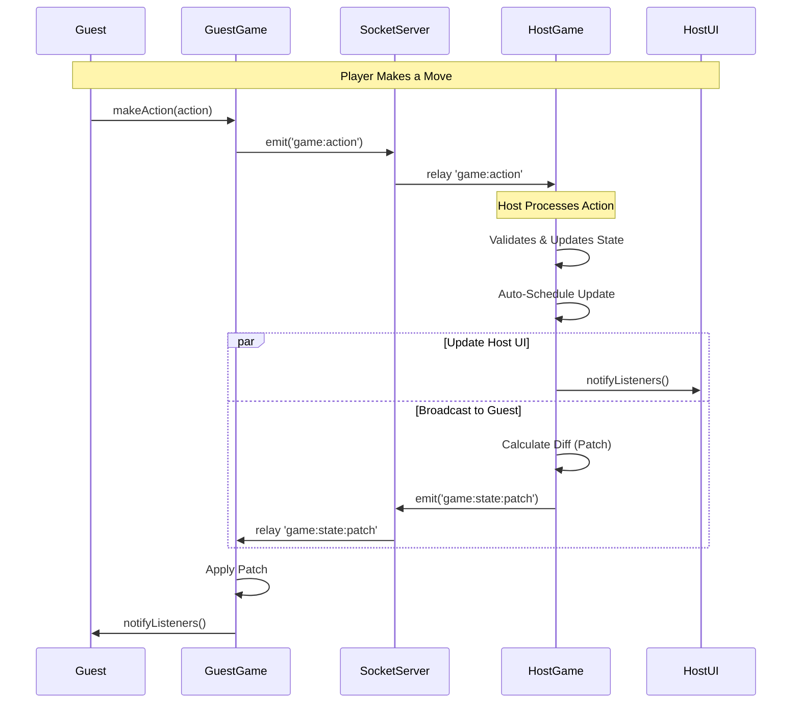

# Game Architecture Documentation

## 📖 Tổng Quan / Overview

Hệ thống game của GameHub được xây dựng dựa trên kiến trúc **client-authoritative** với **host-as-server**. Điều này có nghĩa là:
- **Host** (người tạo phòng) đóng vai trò là server, chịu trách nhiệm xử lý logic game, validate actions và đồng bộ state chuẩn.
- **Guest** (người tham gia) nhận state updates từ host và render UI.
- **Bot** được quản lý hoàn toàn bởi host.

---

## 🏗️ Kiến Trúc Hệ Thống / System Architecture

### 1. Các Thành Phần Chính / Core Components



### 2. BaseGame Deep Dive 🔍

Tất cả các game đều kế thừa từ class `BaseGame<T>` ([BaseGame.ts](./BaseGame.ts)). Đây là core framework xử lý toàn bộ việc đồng bộ và quản lý state.

#### A. State Management & Reactivity
`BaseGame` sử dụng **Immer** và **Proxy** để quản lý state một cách immutable nhưng vẫn giữ API đơn giản:

- **State Proxy:** Khi bạn gọi `this.setState(newState)`, `BaseGame` sẽ wrap state vào một Proxy. Mọi thay đổi sâu bên trong state (như `this.state.players[0].score++`) sẽ tự động trigger update.
- **Auto Update:** Bất kỳ thay đổi nào trên state cũng sẽ schedule một microtask để:
    1. Notify UI listeners (để re-render).
    2. Broadcast state cho guests (nếu `autoBroadcast` = true).

#### B. State Synchronization Optimization 🚀
Để giảm băng thông và CPU, `BaseGame` implement cơ chế đồng bộ thông minh 3 lớp:

1.  **JSON String Compare (Lớp 1):** Mỗi khi state thay đổi, chuyển state thành chuỗi JSON. Nếu chuỗi này giống `lastSyncedJson` (state không đổi về mặt dữ liệu), **KHÔNG** gửi gì cả. Cách này nhanh hơn việc tính Hash.
2.  **Diffing & Patching (Lớp 2):** Nếu state có thay đổi, tính toán sự khác biệt (`getDiff`) giữa state cũ và mới.
    -   Chỉ gửi phần thay đổi (Patch) qua event `game:state:patch`.
    -   Ví dụ: Chỉ gửi `{ currentTurn: 'player2' }` thay vì toàn bộ object state khổng lồ.
3.  **Full Sync (Lớp 3 - Fallback):** Nếu không thể tính diff hoặc có người chơi mới vào, gửi toàn bộ state qua `game:state`.

#### C. Persistence (Lưu Game) 💾
Host tự động lưu state vào `localStorage` mỗi khi state thay đổi.
- **Yêu cầu:** Game phải set tên qua `this.setGameName("mygame")`.
- **Tác dụng:** Nếu host refresh trang, game sẽ load lại state cũ và tiếp tục chơi, không bị mất lượt.

---

## 🎮 Game Flow & Communication

### Socket Events Flow



---

## 🛠️ Hướng Dẫn Tạo Game Mới / Creating a New Game

Giả sử bạn muốn tạo một game tên là **"MyGame"**.

### Bước 1: Tạo Folder và Files
Tạo thư mục `client/src/games/mygame/` với 3 file:
- `MyGame.ts`: Logic game.
- `MyGameUI.tsx`: Giao diện (React).
- `types.ts`: Định nghĩa dữ liệu.

### Bước 2: Định Nghĩa Types (`types.ts`)

```typescript
import { Player } from '../../stores/roomStore';

export interface MyGameState {
  board: string[][];      // Ví dụ: bàn cờ
  currentTurn: string;    // ID người chơi hiện tại
  scores: Record<string, number>;
  players: {
    host: Player | null;
    guest: Player | null;
  };
  winner: string | null;
}

export type MyGameAction =
  | { type: 'MOVE'; x: number; y: number }
  | { type: 'RESET' };
```

### Bước 3: Implement Game Logic (`MyGame.ts`)

```typescript
import { BaseGame, GameAction } from '../BaseGame';
import { MyGameState, MyGameAction } from './types';

export default class MyGame extends BaseGame<MyGameState> {

  constructor(room: any, socket: any, isHost: boolean, userId: string) {
    super(room, socket, isHost, userId);
    // QUAN TRỌNG: Đặt tên game để kích hoạt tính năng lưu game (Persistence)
    this.setGameName('mygame');
  }

  // 1. Khởi tạo State ban đầu
  getInitState(): MyGameState {
    return {
      board: Array(3).fill(null).map(() => Array(3).fill('')),
      currentTurn: this.players[0]?.id || '',
      scores: {},
      players: {
        host: this.players[0] || null,
        guest: this.players[1] || null,
      },
      winner: null,
    };
  }

  // 2. Xử lý logic khi nhận Action (CHỈ CHẠY TRÊN HOST)
  onSocketGameAction(data: { action: GameAction }) {
    if (!this.isHost) return; // Bảo vệ: Guest không được tự ý đổi state

    const action = data.action as MyGameAction;

    switch (action.type) {
      case 'MOVE':
        this.handleMove(action);
        break;
      case 'RESET':
        this.setState(this.getInitState());
        break;
    }
  }

  private handleMove(action: { type: 'MOVE', x: number, y: number }) {
    // Logic game: Validate và update state trực tiếp
    const { x, y } = action;

    // BaseGame dùng Proxy, cứ gán trực tiếp là được!
    if (this.state.board[y][x] === '') {
        this.state.board[y][x] = 'X';
        // Sau khi hàm này chạy xong, BaseGame sẽ tự động:
        // 1. Tính diff
        // 2. Broadcast patch cho guest
        // 3. Lưu vào localStorage
    }
  }
}
```

### Bước 4: Tạo UI Component (`MyGameUI.tsx`)

```typescript
import React, { useEffect, useState } from 'react';
import { GameUIProps } from '../types';
import MyGame from './MyGame';

const MyGameUI: React.FC<GameUIProps> = ({ game, currentUserId }) => {
  const myGame = game as MyGame;
  // Hook state vào React
  const [gameState, setGameState] = useState(myGame.getState());

  useEffect(() => {
    // Subscribe lắng nghe thay đổi từ game core
    const unsubscribe = myGame.onUpdate((newState) => {
      setGameState(newState);
    });
    return unsubscribe;
  }, [myGame]);

  const handleCellClick = (x: number, y: number) => {
    // Gửi action (Game Core sẽ tự quyết định gửi Socket hay xử lý luôn)
    myGame.makeAction({ type: 'MOVE', x, y });
  };

  return (
    <div>
        <h1>Turn: {gameState.currentTurn}</h1>
        {/* Render Board */}
    </div>
  );
};

export default MyGameUI;
```

### Bước 5: Đăng Ký Game (`registry.ts`)

Mở `client/src/games/registry.ts` và thêm vào map `games`:

```typescript
games.set('mygame', {
  id: 'mygame',
  name: { en: 'My Awesome Game', vi: 'Trò Chơi Của Tui' },
  description: { en: 'Best game ever', vi: 'Hay tuyệt cú mèo' },
  icon: SomeLucideIcon,
  categories: ['strategy'],
  minPlayers: 1,
  maxPlayers: 2,
  isAvailable: true,
  // Lazy load để tối ưu performance
  createGame: async (room, socket, isHost, userId) => {
    const { default: MyGame } = await import('./mygame/MyGame');
    return new MyGame(room, socket, isHost, userId);
  },
  loadUI: () => import('./mygame/MyGameUI').then((m) => m.default),
});
```

---

## 💡 Best Practices

1.  **State phải Serializable:** State chỉ được chứa dữ liệu đơn giản (object, array, string, number). Không lưu class instance, function, hay DOM element vào state.
2.  **Logic hoàn toàn ở Host:** UI (`MyGameUI`) chỉ nên hiển thị và gửi action. Đừng viết logic tính điểm hay thắng thua ở UI.
3.  **Bot AI:** Viết logic bot trong class Game. Dùng `setTimeout` để tạo độ trễ cho bot, giúp cảm giác tự nhiên hơn.
4.  **Debug:** Dùng `console.log(this.state)` trong `onSocketGameAction` để xem state thay đổi thế nào.
