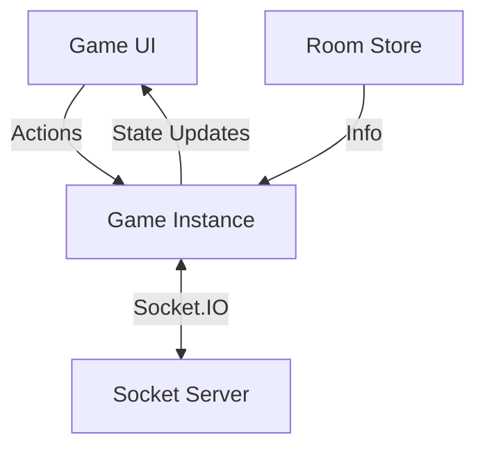

# Game Architecture

## Overview

This platform uses a **client-authoritative** architecture with **host-as-server**:

- **Host**: Processes game logic, validates actions, manages bots, and syncs state
- **Guest**: Receives state patches/updates from host and renders UI
- **BaseGame**: Core framework for synchronization and state management

---

## Architecture

### Components



### BaseGame Deep Dive

#### State & Reactivity

`BaseGame` uses **Immer** & **Proxy** for state management:

- **Proxy Tracking**: Direct mutations (`state.x++`) are automatically recorded as patches
- **Immutable Snapshot**: `useGameState` provides an immutable snapshot (`lastSnapshot`)
- **React Optimization**: Each update forces a new reference for reliable React re-renders

#### Synchronization Optimization

Three-layer sync mechanism for bandwidth optimization:

1. **Patch Compaction**: Changes are collected in a `Map`. If a path changes multiple times (e.g., during movement), only the final value is kept
2. **Incremental Patching**: Only changed parts (patches) are sent via `game:state:patch`
3. **Full Sync**: Complete state is sent when new players join or sync errors occur

---

## Creating a New Game

### File Structure

| File | Purpose |
|------|---------|
| `MyGame.ts` | Extends `BaseGame<T>`, implements `getInitState` and `onSocketGameAction` |
| `MyGameUI.tsx` | Uses `const [state] = useGameState(game)` to get state |
| `types.ts` | Defines `State` and `Action` types |

### Implementation Example

```typescript
// MyGame.ts
export default class MyGame extends BaseGame<MyGameState> {
  getInitState() {
    return { score: 0 };
  }

  onSocketGameAction({ action }) {
    if (!this.isHost) return;
    if (action.type === 'ADD') this.state.score++;
  }
}
```

---

## Best Practices

### 1. Host-Only Logic
Scoring, win/lose conditions should only be in the Game class (runs on Host). UI only sends actions.

### 2. Deterministic State
State should only contain data (objects, arrays, primitives). Do not store classes or functions.

### 3. Always Mutate
Never reassign `this.state = ...`. Mutate directly or use `Object.assign` for Proxy to work correctly.

### 4. Persistence
Call `this.setGameName("name")` to enable automatic save/load on page refresh.

### 5. Bot AI & Side Effects
Avoid scattered `setTimeout` calls. If you need delayed bot actions, manage timers carefully and always clean up in `destroy()` to prevent memory leaks.

### 6. Minimal Game State
Keep state as small as possible to optimize bandwidth (games sync via JSON patches):

| Technique | Example |
|-----------|---------|
| Numeric constants | Use `0` instead of `"betting"` for game phases |
| Tuples over objects | Use `[id, amount]` instead of `{id, amount}` |
| History limits | Limit array lengths with `shift()` or delete old keys |
| Precision | Round decimals: `Math.round(val * 10) / 10` |
| Short IDs | Use `uuidShort()` or round IDs (`R1`, `R2`) instead of `Date.now()` |
