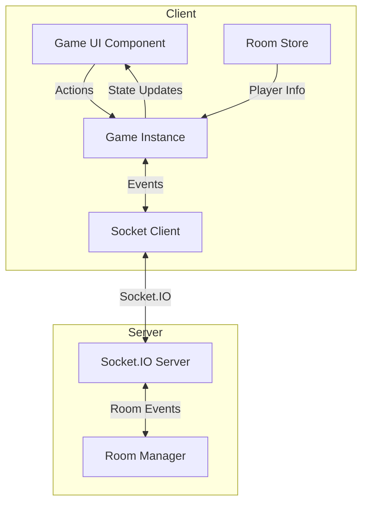
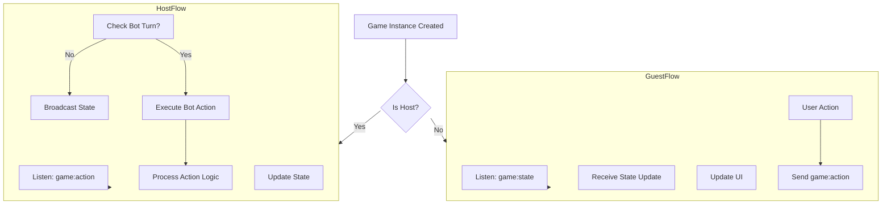
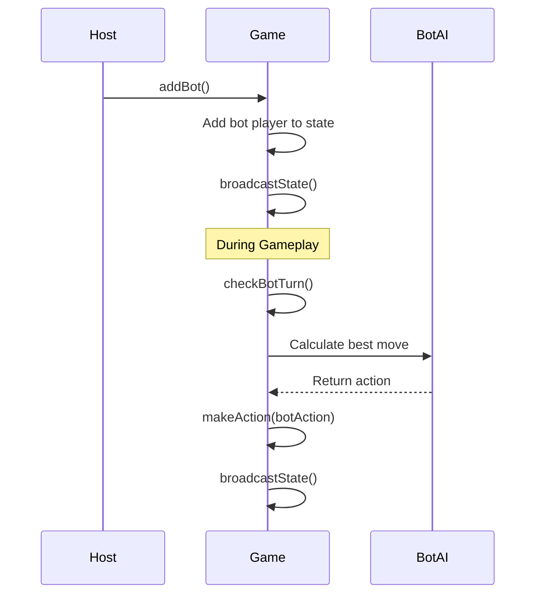
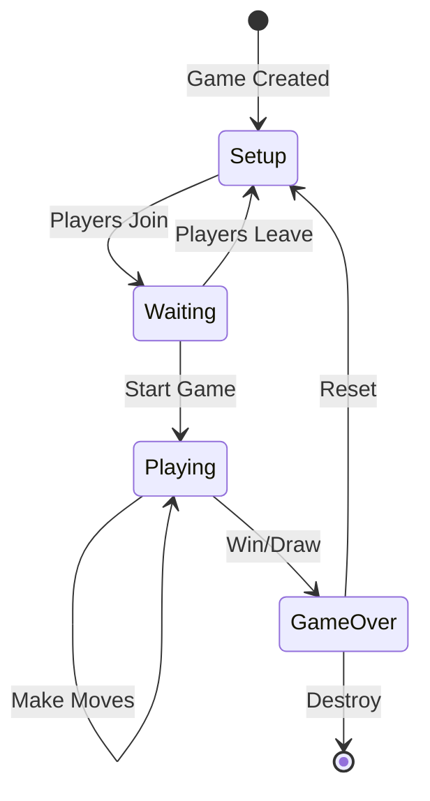

# Game Architecture Documentation

## 📖 Tổng Quan / Overview

Hệ thống game của GameHub được xây dựng dựa trên kiến trúc **client-authoritative** với **host-as-server**. Điều này có nghĩa là:
- **Host** (người tạo phòng) chịu trách nhiệm xử lý logic game và đồng bộ state
- **Guest** (người tham gia) nhận state updates từ host
- **Bot** được quản lý bởi host và tự động thực hiện các hành động

---

## 🏗️ Kiến Trúc Hệ Thống / System Architecture

### 1. Các Thành Phần Chính / Core Components



#### BaseGame Class

Tất cả các game đều kế thừa từ class `BaseGame<T>` ([BaseGame.ts](file:///Users/hoangtran/Desktop/gamehub/client/src/games/BaseGame.ts)):

**Thuộc tính chính:**
- `state: T` - Game state (generic type)
- `isHost: boolean` - Người chơi có phải là host không
- `userId: string` - ID của người chơi hiện tại
- `players: Player[]` - Danh sách người chơi trong phòng
- `socket: Socket` - Socket connection để giao tiếp

**Phương thức quan trọng:**
- `getInitState(): T` - Khởi tạo state ban đầu (abstract)
- `onSocketGameAction(data)` - Xử lý actions từ socket (abstract)
- `makeAction(action)` - Thực hiện một action (client hoặc host)
- `setState(state)` - Cập nhật state và thông báo listeners
- `broadcastState(forceFull?)` - Host broadcast state (auto-detects patch vs full)
- `syncState(forceFull?)` - Đồng bộ state (notification + broadcast)
- `updatePlayers(players)` - Cập nhật danh sách người chơi

**State Sync Optimization:**
`BaseGame` tự động tối ưu hóa băng thông bằng cách:
1. **Hashing:** Kiểm tra `lastSyncedHash`, nếu không đổi thì không gửi tin nhắn.
2. **Diffing:** Tính toán sự thay đổi giữa state mới và cũ.
3. **Patching:** Gửi `game:state:patch` với chỉ dữ liệu thay đổi (nếu có).
4. **Direct Sync:** Khi user request sync, host gửi state trực tiếp cho user đó qua `game:state:direct` thay vì broadcast.
5. **Recovery (Versioning):** Host gắn `version` vào mỗi update. Nếu client nhận patch với version không khớp (`current + 1`), client sẽ tự động `requestSync` (chống corrupted state do packet loss).
6. **Fallback:** Gửi full state `game:state` nếu có thay đổi lớn hoặc người dùng mới vào (hoặc hồi phục sau lỗi).

---

### 2. Socket Communication Flow

```mermaid
sequenceDiagram
    participant Guest
    participant GuestGame
    participant Socket
    participant Server
    participant HostGame
    participant Host UI

    Note over Guest,Host UI: Player Makes a Move
    Guest->>GuestGame: makeAction(action)
    GuestGame->>Socket: emit('game:action', action)
    Socket->>Server: Forward action
    Server->>HostGame: relay 'game:action'

    Note over HostGame: Host validates & processes
    HostGame->>HostGame: onSocketGameAction(action)
    HostGame->>HostGame: Update state
    HostGame->>Host UI: notifyListeners(newState)
    HostGame->>Socket: emit('game:state', newState)
    Socket->>Server: Broadcast state
    Server->>GuestGame: relay 'game:state'
    GuestGame->>GuestGame: setState(newState)
    GuestGame->>Guest: notifyListeners(newState)
```



**Socket Events:**

| Event | Direction | Description | Data |
|-------|-----------|-------------|------|
| `game:action` | Client → Server → Host | Guest gửi action cho host xử lý | `{ roomId, action }` |
| `game:state` | Host → Server → Clients | Host broadcast state mới (Full) | `{ roomId, state, version }` |
| `game:state:patch` | Host → Server → Clients | Host gửi bản cập nhật thay đổi (Delta) | `{ roomId, patch, version }` |
| `game:request_sync` | Client → Server → Host | Yêu cầu Host gửi lại Full State | `{ roomId, requesterSocketId }` |
| `game:state:direct` | Host → Server → Client | Host gửi state trực tiếp cho 1 user | `{ roomId, targetSocketId, state, version }` |

---

## 🎮 Luồng Game Flow / Game Flow

### 3. Host vs Guest vs Bot



#### Host Responsibilities

**Host là "game server" và chịu trách nhiệm:**
1. ✅ Xử lý tất cả game actions
2. ✅ Validate moves/actions
3. ✅ Cập nhật game state
4. ✅ Broadcast state cho guests
5. ✅ Quản lý bot players
6. ✅ Lưu/load state (localStorage)
7. ✅ Kiểm tra win conditions
8. ✅ Optimization (Delta Updates)

**Code pattern:**
```typescript
onSocketGameAction(data: { action: GameAction }): void {
  // ...
  // Host updates and syncs
  this.syncState(); // Automatically decides patch vs full
}
```
**Optimized Sync:**
- `syncState()`: Tự động so sánh hash/diff và gửi patch.
- `syncState(true)`: Force gửi full state (ví dụ: khi có người chơi mới).
**Code pattern:**
```typescript
onSocketGameAction(data: { action: GameAction }): void {
  const action = data.action as MyGameAction;

  // ONLY host processes actions
  if (!this.isHost) return;

  switch (action.type) {
    case 'MAKE_MOVE':
      this.handleMove(action);
      break;
    // ... other actions
  }
}
```

#### Guest Responsibilities

**Guest chỉ:**
1. ✅ Nhận state updates từ host
2. ✅ Render UI dựa trên state
3. ✅ Gửi actions cho host thông qua socket

**Code pattern:**
```typescript
makeAction(action: GameAction) {
  if (this.isHost) {
    // Host xử lý trực tiếp
    this.onSocketGameAction({ action });
  } else {
    // Guest gửi qua socket
    this.sendSocketGameAction(action);
  }
}
```

#### Bot Management

**Bot được quản lý hoàn toàn bởi Host:**



**Example Bot Implementation:**
```typescript
// Check if it's bot's turn after state change
private checkBotTurn(): void {
  if (!this.isHost) return;

  const currentPlayer = this.getCurrentPlayer();
  if (currentPlayer?.isBot && !this.state.gameOver) {
    setTimeout(() => this.makeBotMove(), 600); // Delay for realism
  }
}

// Bot AI logic
private makeBotMove(): void {
  const bestMove = this.getBestMove(); // Minimax, Random, etc.
  this.makeAction({
    type: 'MAKE_MOVE',
    playerId: 'BOT',
    // ... move data
  });
}
```

---

### 4. Game Lifecycle



**Các giai đoạn:**

1. **Setup** (`constructor`)
   - Khởi tạo state
   - Bind socket listeners
   - Gọi `init()`

2. **Waiting** (chờ đủ người chơi)
   - Host có thể thêm/xóa bot
   - Players join/leave
   - Host start game khi ready

3. **Playing** (đang chơi)
   - Process actions
   - Update state
   - Check win conditions
   - Bot auto-play

4. **GameOver** (kết thúc)
   - Clear saved state
   - Show results

5. **Destroy** (`destroy()`)
   - Remove socket listeners
   - Cleanup resources

---

## 📁 Cấu Trúc Thư Mục / Directory Structure

```
client/src/games/
├── BaseGame.ts              # Base class cho tất cả games
├── registry.ts              # Game registration system
├── types.ts                 # Common types
├── GameContainer.tsx        # Container component
│
├── <game-name>/             # Mỗi game có folder riêng
│   ├── <GameName>.ts        # Game logic class
│   ├── <GameName>UI.tsx     # UI component
│   └── types.ts             # Game-specific types
│
├── tictactoe/
│   ├── TicTacToe.ts
│   ├── TicTacToeUI.tsx
│   └── types.ts
│
├── chess/
│   ├── Chess.ts
│   ├── ChessUI.tsx
│   └── types.ts
│
└── werewolf/
    ├── Werewolf.ts
    ├── WerewolfUI.tsx
    └── types.ts
```

---

## 🛠️ Hướng Dẫn Tạo Game Mới / Creating a New Game

### Bước 1: Tạo Folder và Files

```bash
cd client/src/games
mkdir mygame
touch mygame/MyGame.ts
touch mygame/MyGameUI.tsx
touch mygame/types.ts
```

### Bước 2: Định Nghĩa Types

**`mygame/types.ts`:**
```typescript
// Game state interface
export interface MyGameState {
  // Game data
  board: any;
  currentTurn: string;
  gameOver: boolean;
  winner: string | null;

  // Players
  players: {
    player1: Player | null;
    player2: Player | null;
  };

  // Other state...
}

// Action types
export type MyGameAction =
  | { type: 'MAKE_MOVE'; playerId: string; /* move data */ }
  | { type: 'RESET_GAME' }
  | { type: 'START_GAME' };
```

### Bước 3: Implement Game Logic Class

**`mygame/MyGame.ts`:**
```typescript
import { BaseGame, type GameAction, type GameResult } from '../BaseGame';
import type { MyGameState, MyGameAction } from './types';
import type { Player } from '../../stores/roomStore';

export default class MyGame extends BaseGame<MyGameState> {

  // 1️⃣ REQUIRED: Khởi tạo state ban đầu
  getInitState(): MyGameState {
    return {
      board: /* initial board */,
      currentTurn: 'player1',
      gameOver: false,
      winner: null,
      players: {
        player1: this.players[0] || null,
        player2: this.players[1] || null,
      },
    };
  }

  // 2️⃣ REQUIRED: Xử lý actions (ONLY HOST)
  onSocketGameAction(data: { action: GameAction }): void {
    const action = data.action as MyGameAction;

    // IMPORTANT: Only host processes
    if (!this.isHost) return;

    switch (action.type) {
      case 'MAKE_MOVE':
        this.handleMove(action);
        break;
      case 'RESET_GAME':
        this.reset();
        break;
      case 'START_GAME':
        this.startGame();
        break;
    }
  }

  // 3️⃣ Game logic methods
  private handleMove(action: MyGameAction): void {
    // Validate move
    if (this.state.gameOver) return;
    if (!this.isValidMove(action)) return;

    // Update state
    this.applyMove(action);

    // Check win condition
    const result = this.checkWinCondition();
    if (result) {
      this.state.gameOver = true;
      this.state.winner = result.winner;
      this.broadcastGameEnd(result);
    }

    // Sync state to all clients
    this.syncState();

    // Check if bot should play
    this.checkBotTurn();
  }

  // 4️⃣ Bot management (if needed)
  addBot(): void {
    if (!this.isHost) return;

    this.state.players.player2 = {
      id: 'BOT',
      username: 'Bot',
      isHost: false,
      isBot: true,
    };
    this.syncState();
  }

  removeBot(): void {
    if (!this.isHost) return;

    this.state.players.player2 = null;
    this.syncState();
  }

  private checkBotTurn(): void {
    if (!this.isHost) return;

    const currentPlayer = this.getCurrentPlayer();
    if (currentPlayer?.isBot && !this.state.gameOver) {
      setTimeout(() => this.makeBotMove(), 600);
    }
  }

  private makeBotMove(): void {
    // Bot AI logic
    const bestMove = this.calculateBestMove();
    this.makeAction({
      type: 'MAKE_MOVE',
      playerId: 'BOT',
      ...bestMove,
    });
  }

  // 5️⃣ Update players when room changes
  updatePlayers(players: Player[]): void {
    super.updatePlayers(players);

    this.state.players.player1 = players[0] || null;

    // Keep bot if exists, otherwise use human player
    if (players[1]) {
      this.state.players.player2 = players[1];
    } else if (!this.state.players.player2?.isBot) {
      this.state.players.player2 = null;
    }

    this.syncState();
  }

  // 6️⃣ Reset game
  reset(): void {
    this.state = this.getInitState();
    this.state.players = { ...this.state.players }; // Keep players
    this.syncState();
  }

  // 7️⃣ Helper methods
  private isValidMove(action: MyGameAction): boolean {
    // Validation logic
    return true;
  }

  private applyMove(action: MyGameAction): void {
    // Apply move to state
  }

  private checkWinCondition(): GameResult | null {
    // Check win/draw
    return null;
  }

  private getCurrentPlayer(): Player | null {
    return this.state.currentTurn === 'player1'
      ? this.state.players.player1
      : this.state.players.player2;
  }

  // 8️⃣ Public methods for UI
  public requestMove(/* move data */): void {
    this.makeAction({
      type: 'MAKE_MOVE',
      playerId: this.userId,
      // ... move data
    });
  }

  public requestReset(): void {
    this.makeAction({ type: 'RESET_GAME' });
  }
}
```

### Bước 4: Implement UI Component

**`mygame/MyGameUI.tsx`:**
```typescript
import { useEffect, useState } from 'react';
import type { GameUIProps } from '../types';
import type MyGame from './MyGame';
import type { MyGameState } from './types';

export default function MyGameUI({ game, currentUserId }: GameUIProps) {
  const myGame = game as MyGame;
  const [state, setState] = useState<MyGameState>(myGame.getState());

  // Subscribe to state updates
  useEffect(() => {
    const unsubscribe = myGame.onUpdate((newState) => {
      setState(newState);
    });
    return unsubscribe;
  }, [myGame]);

  // Event handlers
  const handleMove = (/* move params */) => {
    myGame.requestMove(/* move data */);
  };

  const handleReset = () => {
    myGame.requestReset();
  };

  const handleAddBot = () => {
    myGame.addBot();
  };

  const handleRemoveBot = () => {
    myGame.removeBot();
  };

  // Render
  return (
    <div className="game-container">
      {/* Game board */}
      <div className="board">
        {/* Render game board based on state */}
      </div>

      {/* Game info */}
      <div className="info">
        <p>Current Turn: {state.currentTurn}</p>
        {state.gameOver && <p>Winner: {state.winner}</p>}
      </div>

      {/* Controls */}
      <div className="controls">
        <button onClick={handleReset}>Reset</button>
        {myGame.isHost && !state.players.player2 && (
          <button onClick={handleAddBot}>Add Bot</button>
        )}
        {myGame.isHost && state.players.player2?.isBot && (
          <button onClick={handleRemoveBot}>Remove Bot</button>
        )}
      </div>
    </div>
  );
}
```

### Bước 5: Register Game

**Thêm vào `registry.ts`:**
```typescript
import { /* icons */ } from 'lucide-react';

games.set('mygame', {
  id: 'mygame',
  name: {
    en: 'My Game',
    vi: 'Trò Chơi Của Tôi'
  },
  description: {
    en: 'A fun game to play!',
    vi: 'Một trò chơi vui vẻ!',
  },
  icon: /* Choose an icon */,
  categories: ['board', 'strategy'], // Choose categories
  minPlayers: 2,
  maxPlayers: 4,
  isAvailable: true,

  // Lazy load game class
  createGame: async (roomId, socket, isHost, userId, players) => {
    const { default: MyGame } = await import('./mygame/MyGame');
    return new MyGame(roomId, socket, isHost, userId, players);
  },

  // Lazy load UI component
  loadUI: () => import('./mygame/MyGameUI').then((m) => m.default),
});
```

---

## ✅ Checklist Tạo Game Mới

- [ ] Tạo folder `client/src/games/<game-name>/`
- [ ] Tạo file `types.ts` với `State` và `Action` types
- [ ] Tạo class game kế thừa `BaseGame<State>`
  - [ ] Implement `getInitState()`
  - [ ] Implement `onSocketGameAction()`
  - [ ] Implement game logic methods
  - [ ] Implement bot AI (optional)
  - [ ] Implement `updatePlayers()`
  - [ ] Implement `reset()`
- [ ] Tạo UI component
  - [ ] Subscribe to state updates với `onUpdate()`
  - [ ] Implement event handlers
  - [ ] Render game board/UI
- [ ] Register game trong `registry.ts`
- [ ] Test game với:
  - [ ] 2 players (host + guest)
  - [ ] 1 player + bot
  - [ ] Multiple bots
  - [ ] Join/leave scenarios
  - [ ] Reset game

---

## 🎯 Best Practices

### 1. State Management
- ✅ State chỉ được update bởi **Host**
- ✅ Guest chỉ nhận state, không modify trực tiếp
- ✅ Luôn gọi `syncState()` sau khi update state
- ✅ Sử dụng immutable patterns khi có thể

### 2. Action Validation
```typescript
onSocketGameAction(data: { action: GameAction }): void {
  // Always check isHost first
  if (!this.isHost) return;

  // Validate action
  if (!this.isValidAction(action)) return;

  // Process action
  this.handleAction(action);
}
```

### 3. Bot Management
- ✅ Bot logic chỉ chạy trên Host
- ✅ Add delay để bot action trông tự nhiên hơn
- ✅ Clear bot khi có guest join (nếu cần)

### 4. Error Handling
```typescript
try {
  const result = this.processMove(action);
  if (!result.success) {
    console.error('Invalid move:', result.error);
    return;
  }
  this.syncState();
} catch (error) {
  console.error('Move processing failed:', error);
}
```

### 5. Cleanup
```typescript
destroy(): void {
  super.destroy(); // Remove socket listeners

  // Clean up timers
  if (this.gameTimer) {
    clearInterval(this.gameTimer);
  }

  // Clean up resources
  // ...
}
```

---

## 🔍 Example Games Reference

### Simple Game: [TicTacToe](file:///Users/hoangtran/Desktop/gamehub/client/src/games/tictactoe)
- ✅ 2 players
- ✅ Simple bot AI (Minimax)
- ✅ Turn-based
- ✅ Good starting point

### Complex Game: [Chess](file:///Users/hoangtran/Desktop/gamehub/client/src/games/chess)
- ✅ External library (chess.js)
- ✅ Advanced bot (Stockfish via Worker)
- ✅ Complex validation

### Party Game: [Werewolf](file:///Users/hoangtran/Desktop/gamehub/client/src/games/werewolf)
- ✅ Multiple players (5-12)
- ✅ Multiple bots
- ✅ Complex phases
- ✅ Chat system
- ✅ Timers

---

## 📚 Additional Resources

- [BaseGame API](file:///Users/hoangtran/Desktop/gamehub/client/src/games/BaseGame.ts)
- [Socket Service](file:///Users/hoangtran/Desktop/gamehub/client/src/services/socket.ts)
- [Game Registry](file:///Users/hoangtran/Desktop/gamehub/client/src/games/registry.ts)
- [Room Store](file:///Users/hoangtran/Desktop/gamehub/client/src/stores/roomStore.ts)

---

## 💡 Tips & Tricks

1. **Debug State**: Thêm `console.log(this.state)` trong `onSocketGameAction` để debug
2. **Test Bot**: Test bot với `setTimeout` delays khác nhau
3. **State Sync**: Nếu UI không update, check xem có gọi `syncState()` chưa
4. **Action Flow**: Dùng `console.log` để trace action flow: Client → Socket → Host → State → Broadcast
5. **Persisted State**: Host tự động lưu state vào localStorage, load lại khi refresh

---

**Happy Coding! 🎮**

Nếu có thắc mắc, tham khảo các game examples hoặc hỏi team! 😊
