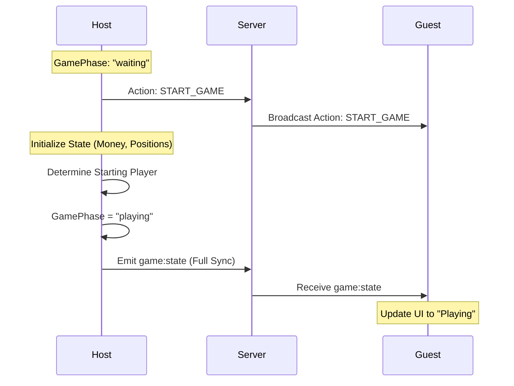
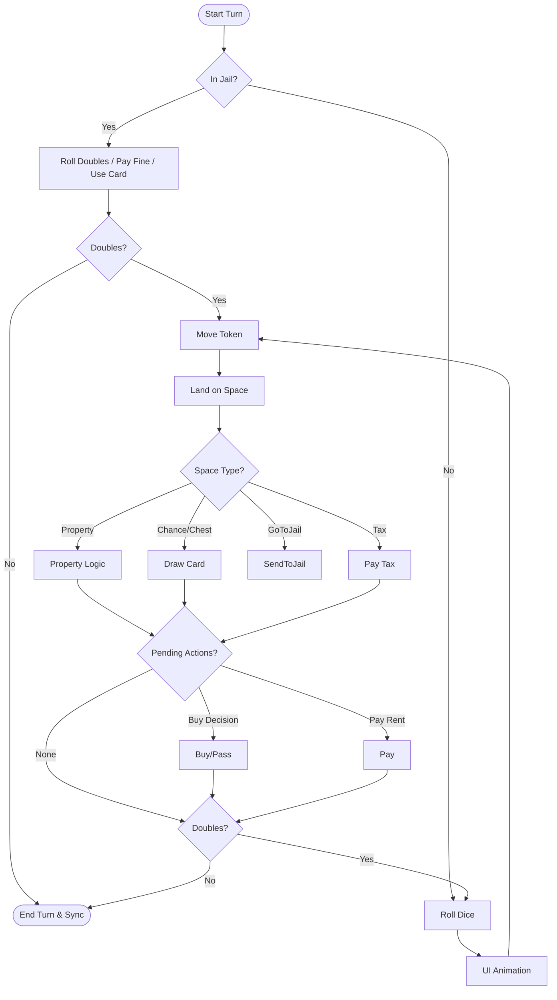
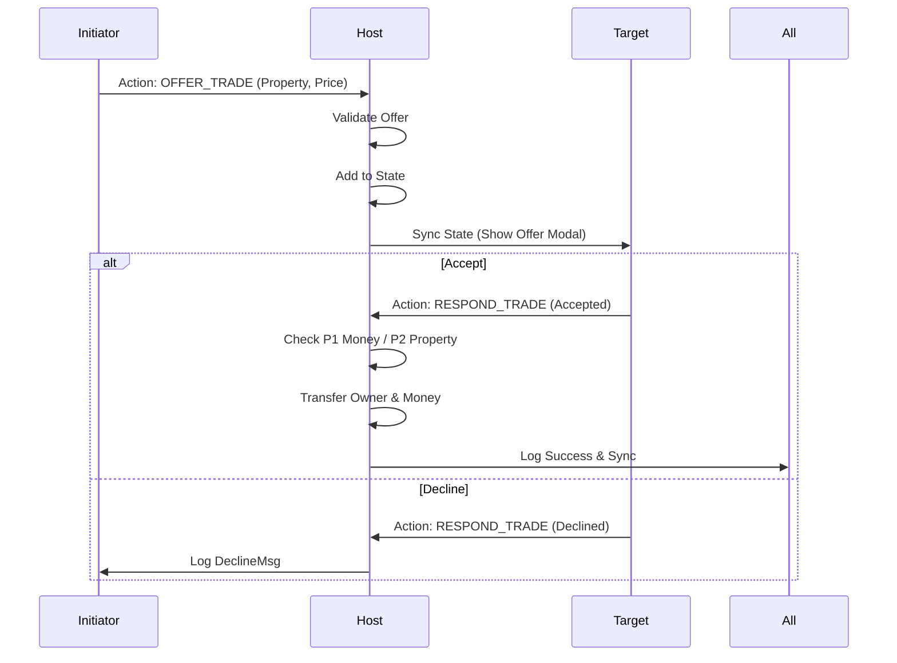
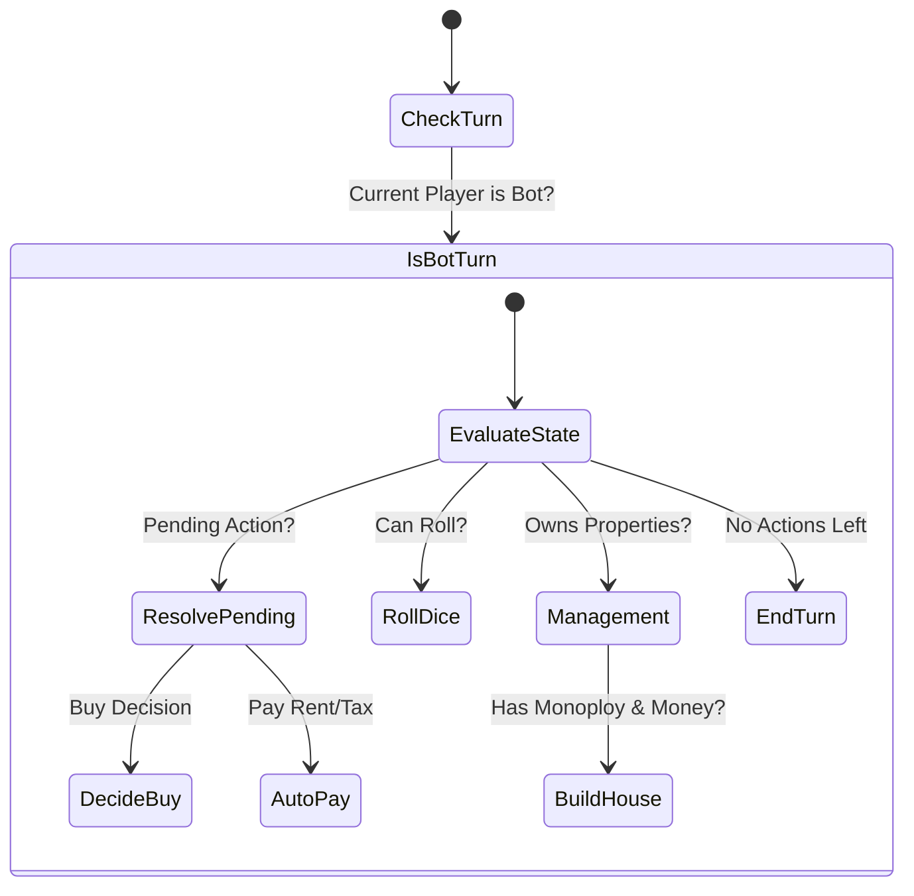

# Monopoly Game Documentation

This directory contains the implementation of the Monopoly game module. It is built using React (frontend) and Socket.IO (real-time communication), following a **Host-Server-Client** architecture where the Host maintains the authoritative game state and broadcasts it to other clients.

## Architecture Overview

-   **Monopoly.ts**: Core game logic, state management, and socket event handling.
-   **MonopolyUI.tsx**: React component for rendering the game board and UI.
-   **types.ts**: TypeScript definitions for game state, players, properties, and cards.

## Game Flows

### 1. Game Initialization & Start

The game starts in a "waiting" phase. The Host adds/removes bots or waits for players. Once started, the phase shifts to "playing".



### 2. Player Turn Flow

A standard turn involves rolling dice, moving, handling the landing space, and ending the turn.



### 3. Property Interaction Logic

When a player lands on a property (Street, Railroad, Utility), the following logic applies:

```mermaid
flowchart LR
    Land[Land on Property] --> Owned{Owned?}

    Owned -- No --> Afford{Can Afford?}
    Afford -- Yes --> Prompt[Prompt Buy/Decline]
    Afford -- No --> Alert[Alert: Not enough money]

    Owned -- Yes --> IsMyOwn{Is My Own?}
    IsMyOwn -- Yes --> Relax[Relax / Build Houses]
    IsMyOwn -- No --> Mortgaged{Mortgaged?}

    Mortgaged -- Yes --> Free[No Rent (Free)]
    Mortgaged -- No --> Rent[Calculate & Pay Rent]
```

### 4. Trading System

Trading allows players to exchange properties for money.



### 5. Bot Logic (Host Side)

Bots are controlled entirely by the Host's browser instance.


