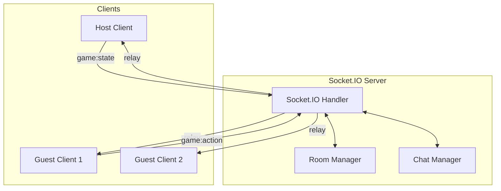
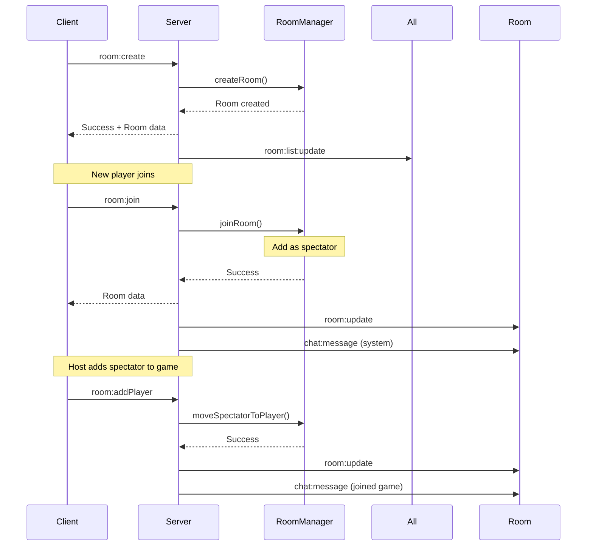

# 🎮 GameHub Server

> Real-time Socket.IO relay server for multiplayer gaming

## 📖 Overview

The GameHub server is a lightweight **Socket.IO relay server** that handles:
- 🏠 Room creation and management
- 👥 Player/spectator coordination
- 💬 Real-time chat system
- 🎮 Game event relay (pure relay - no game logic)
- 📊 Server statistics and health monitoring

**Architecture Pattern**: The server acts as a **pure relay** - it does NOT process game logic. All game state is managed on the client side (host).

---

## 🏗️ Architecture



### Key Components

#### 1. **server.ts** - Main Server
- Express HTTP server setup
- Socket.IO initialization with CORS
- Event handlers for all socket events
- Health check and stats endpoints

#### 2. **RoomManager.ts** - Room State Manager
- Room creation/deletion
- Player/spectator management
- Room list management
- Socket ID tracking for reconnections

#### 3. **types.ts** - TypeScript Definitions
- Room interface
- Player interface
- Chat message types
- Event data types

---

## 🔌 Socket Events

### Connection Events

#### `connection`
**Server → Client** (automatic)
- Fired when a client connects
- Receives `userId` and `username` from `socket.handshake.auth`
- Updates player socket ID for reconnections

```typescript
// Client side
const socket = io(SERVER_URL, {
  auth: { userId, username }
});
```

#### `disconnect`
**Client → Server** (automatic)
- Fired when client disconnects
- Automatically removes player from room
- Notifies other players in room

---

### Room Events

#### `room:create`
**Client → Server**
Create a new room.

```typescript
// Request
socket.emit('room:create', {
  name: string,
  gameType: string,
  isPublic: boolean,
  password?: string,
  maxPlayers: number
}, (response) => {
  // Handle response
});

// Response
{
  success: boolean,
  room?: Room,
  error?: string
}
```

#### `room:join`
**Client → Server**
Join an existing room (as spectator initially).

```typescript
socket.emit('room:join', {
  roomId: string,
  password?: string
}, (response) => {
  // Handle response
});

// Response
{
  success: boolean,
  room?: Room,
  error?: string
}
```

**Note**: If room doesn't exist, server auto-creates it using saved settings.

#### `room:leave`
**Client → Server**
Leave current room.

```typescript
socket.emit('room:leave', {
  roomId: string
});
```

#### `room:update`
**Server → Clients** (broadcast)
Notifies all clients in room of updated room state.

```typescript
// Received by clients
socket.on('room:update', (room: Room) => {
  // Update local room state
});
```

#### `room:list`
**Client → Server**
Get list of public rooms.

```typescript
socket.emit('room:list', (rooms: Room[]) => {
  // Handle room list
});
```

#### `room:list:update`
**Server → All Clients** (broadcast)
Notifies all clients when public room list changes.

```typescript
socket.on('room:list:update', (rooms: Room[]) => {
  // Update room list UI
});
```

#### `room:deleted`
**Server → Room Clients** (room broadcast)
Notifies room members that room was deleted.

```typescript
socket.on('room:deleted', ({ reason }) => {
  // Handle room deletion
});
```

#### `room:kicked`
**Server → Client** (private)
Notifies user they were kicked.

```typescript
socket.on('room:kicked', ({ reason }) => {
  // Handle being kicked
});
```

---

### Player Management Events

#### `room:addPlayer`
**Client → Server** (Host only)
Move spectator to player slot.

```typescript
socket.emit('room:addPlayer', {
  roomId: string,
  userId: string
}, (response) => {
  // Handle response
});
```

#### `room:removePlayer`
**Client → Server** (Host only)
Move player to spectator.

```typescript
socket.emit('room:removePlayer', {
  roomId: string,
  userId: string
}, (response) => {
  // Handle response
});
```

#### `room:kick`
**Client → Server** (Host only)
Remove user from room entirely.

```typescript
socket.emit('room:kick', {
  roomId: string,
  userId: string
}, (response) => {
  // Handle response
});
```

---

### Game Events (Pure Relay)

**Important**: The server does NOT process game logic. It only relays events between clients.

#### `game:action`
**Client → Server → Other Clients**
Relay game action from guest to host.

```typescript
// Guest sends action
socket.emit('game:action', {
  roomId: string,
  action: GameAction
});

// Host receives action
socket.on('game:action', ({ roomId, action }) => {
  // Process action (on host)
});
```

#### `game:state`
**Host → Server → Clients**
Relay game state from host to all guests.

```typescript
// Host broadcasts state
socket.emit('game:state', {
  roomId: string,
  state: GameState,
  version: number
});

// Guests receive state
socket.on('game:state', ({ roomId, state, version }) => {
  // Update local state and version
});
```

#### `game:state:patch`
**Host → Server → Clients**
Relay **delta** state update (optimization).

```typescript
// Host sends patch
socket.emit('game:state:patch', {
  roomId: string,
  patch: any, // Delta patch
  version: number
});

// Guests receive patch
socket.on('game:state:patch', ({ roomId, patch, version }) => {
  // Apply patch to local state
});
```

#### `game:request_sync`
**Client → Server → Host**
Client requests full state sync (e.g. after packet loss or reconnection).

```typescript
// Client requests sync
socket.emit('game:request_sync', {
  roomId: string
});

// Host receives request with requester ID
socket.on('game:request_sync', ({ roomId, requesterSocketId }) => {
  // Host decides to broadcast or direct sync
});
```

#### `game:state:direct`
**Host → Server → Client**
Host sends state directly to a specific client (response to sync request).

```typescript
// Host sends direct state
socket.emit('game:state:direct', {
  roomId: string,
  targetSocketId: string,
  state: GameState,
  version: number
});

// Specific client receives state
socket.on('game:state', ({ roomId, state, version }) => {
  // Update local state
});
```

---

### Chat Events

#### `chat:message`
**Client → Server → Room Clients**
Send chat message to room.

```typescript
// Send message
socket.emit('chat:message', {
  roomId: string,
  userId: string,
  username: string,
  message: string,
  type?: 'user' | 'system'
});

// Receive message
socket.on('chat:message', (message: ChatMessage) => {
  // Display message
});
```

#### `chat:history`
**Client → Server**
Request chat history for room.

```typescript
socket.emit('chat:history', {
  roomId: string
}, (messages: ChatMessage[]) => {
  // Display history
});
```

---

### Statistics Events

#### `stats:online`
**Client → Server**
Get current online user count.

```typescript
socket.emit('stats:online', (response) => {
  console.log(response.online); // Number of connected clients
});
```

---

## 🌐 HTTP Endpoints

### `GET /health`
Health check endpoint.

```bash
curl http://localhost:3001/health
```

**Response:**
```json
{
  "status": "ok",
  "timestamp": "2026-01-21T02:57:55.000Z"
}
```

### `GET /stats`
Server statistics.

```bash
curl http://localhost:3001/stats
```

**Response:**
```json
{
  "online": 42,
  "rooms": 12,
  "players": 35,
  "startTime": "2026-01-20T14:30:00.000Z",
  "uptime": "0d 12h 27m 55s"
}
```

---

## 📦 Data Models

### Room
```typescript
interface Room {
  id: string;               // Room ID (usually username)
  name: string;             // Display name
  ownerId: string;          // Host user ID
  gameType: string;         // Current game type
  isPublic: boolean;        // Public/private
  password?: string;        // Password for private rooms
  players: Player[];        // Active players
  spectators: Player[];     // Spectators
  maxPlayers: number;       // Max player slots
  createdAt: number;        // Timestamp
}
```

### Player
```typescript
interface Player {
  id: string;               // User ID
  username: string;         // Display name
  isHost: boolean;          // Is room owner
  socketId: string;         // Socket connection ID
}
```

### ChatMessage
```typescript
interface ChatMessage {
  id: string;               // Message ID (UUID)
  roomId: string;           // Target room
  userId: string;           // Sender ID
  username: string;         // Sender name
  message: string;          // Message content
  timestamp: number;        // Unix timestamp
  type?: 'user' | 'system'; // Message type
}
```

---

## 🚀 Getting Started

### Prerequisites
- Node.js v18+
- npm or bun

### Installation

```bash
cd server
npm install
```

### Environment Variables

Create `.env` file:
```env
PORT=3001
CLIENT_URL=http://localhost:5173
NODE_ENV=development
```

### Running the Server

**Development:**
```bash
npm run dev
# Server runs on http://localhost:3001
# Auto-restart on file changes
```

**Production:**
```bash
npm run build
npm start
```

---

## 🔧 Configuration

### CORS
Configure allowed client origins in `.env`:
```env
CLIENT_URL=https://yourdomain.com
```

For multiple origins, modify `server.ts`:
```typescript
cors: {
  origin: [CLIENT_URL, 'https://another-domain.com'],
  methods: ['GET', 'POST'],
  credentials: true,
}
```

### Chat History Limit
Modify in `server.ts`:
```typescript
// Keep last 50 messages (line ~478)
if (history.length > 50) {
  history.shift();
}
```

---

## 🏠 Room Management Flow



---

## 🎯 Key Design Decisions

### 1. **Pure Relay Pattern**
- Server does NOT validate game moves
- Server does NOT maintain game state
- All game logic runs on client (host)
- Reduces server complexity and load

### 2. **Spectator-First Join**
- New joiners become spectators
- Host manually adds to player slots
- Prevents accidental joins during active games

### 3. **Host Authority**
- Room deleted when host leaves
- Only host can manage players
- Only host can change game type

### 4. **Automatic Room Recreation**
- Room settings saved (gameType, name)
- If room not found, auto-create using saved settings
- Enables persistent room IDs

### 5. **Socket ID Tracking**
- Updates socket ID on reconnection
- Enables seamless reconnection handling

---

## 🐛 Debugging

### Enable Detailed Logs
```typescript
// In server.ts, uncomment console.logs
console.log('game:action', data);
console.log('game:state', data);
```

### Monitor WebSocket Traffic
Use browser DevTools → Network → WS tab to inspect Socket.IO frames.

### Test Connection
```bash
# Check server health
curl http://localhost:3001/health

# Check stats
curl http://localhost:3001/stats
```

---

## 🚀 Deployment

### Railway / Render / Fly.io

1. **Environment Variables:**
   ```env
   PORT=3001
   CLIENT_URL=https://your-client-domain.com
   NODE_ENV=production
   ```

2. **Build Command:**
   ```bash
   npm install && npm run build
   ```

3. **Start Command:**
   ```bash
   npm start
   ```

### WebSocket Support
Ensure your hosting platform supports WebSocket connections:
- ✅ Railway
- ✅ Render
- ✅ Fly.io
- ✅ Heroku
- ❌ Vercel (use serverless Socket.IO adapter)

---

## 📚 Related Documentation

- [Client Game Architecture](../client/src/games/README.md)
- [Room Store](../client/src/stores/roomStore.ts)
- [Socket Service](../client/src/services/socket.ts)

---

## 💡 Tips

1. **Scaling**: For horizontal scaling, use [Socket.IO Redis adapter](https://socket.io/docs/v4/redis-adapter/)
2. **Rate Limiting**: Add rate limiting for chat and actions to prevent spam
3. **Auth**: For production, add proper authentication beyond username
4. **Monitoring**: Integrate APM tools (Sentry, New Relic) for error tracking
5. **Testing**: Use [socket.io-client](https://www.npmjs.com/package/socket.io-client) for unit tests

---

**Happy Coding! 🎮**
