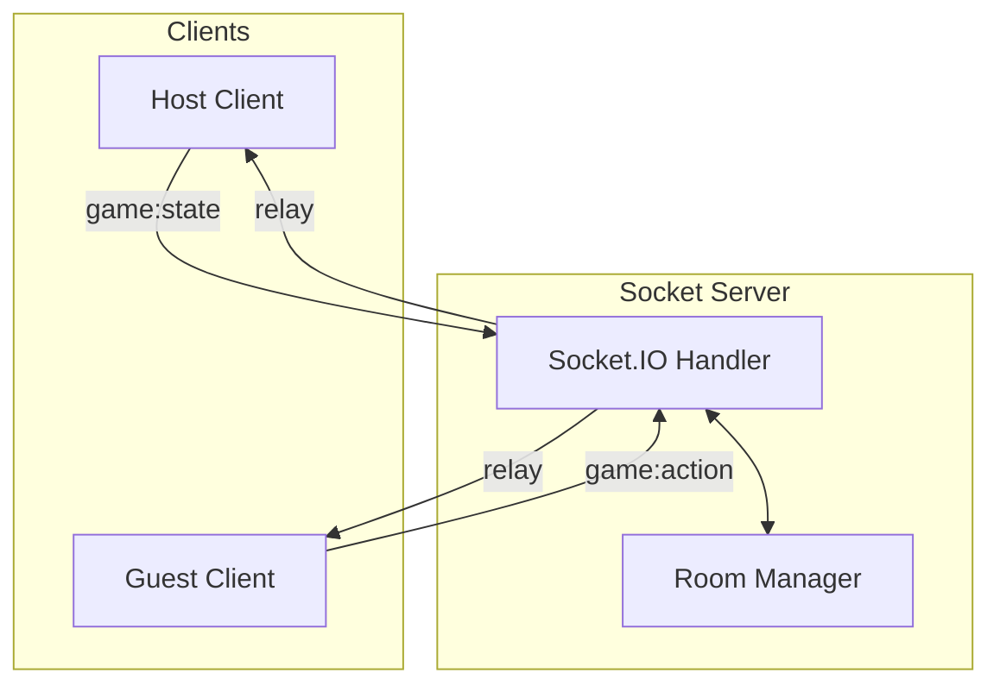

# 🎮 GameHub Server

Relay server thời gian thực sử dụng Socket.IO.

## 📖 Tổng Quan / Overview
Server đóng vai trò là **Pure Relay** (Chỉ chuyển tiếp dữ liệu):
- 🏠 Quản lý Phòng (Room) và Player.
- 💬 Hệ thống Chat Real-time.
- 🎮 Chuyển tiếp Action và State (Không chứa logic game).

---

## 🏗️ Kiến Trúc / Architecture


### Flow chính:
1. **Pure Relay Pattern**: Server không validate action, không lưu game state. Mọi thứ được xử lý tại Host Client.
2. **Spectator-First**: Người mới vào sẽ là khán giả, Host sẽ thủ công thêm vào slot chơi để tránh phá hỏng game đang diễn ra.
3. **Host Authority**: Phòng sẽ bị xóa khi Host rời đi (trừ trường hợp tự động recreation khi Host quay lại).

---

## 🚀 Cài Đặt / Development
```bash
cd server
bun install
bun run dev  # Chạy port 3001
```

### Biến môi trường (.env):
- `PORT`: Mặc định 3001
- `CLIENT_URL`: URL của frontend để cấu hình CORS

---

## 🔌 API & Events
- **HTTP**: `/health` (Health check), `/stats` (Online users, rooms count).
- **Socket**:
  - Room: `room:create`, `room:join`, `room:update`.
  - Game: `game:action`, `game:state`, `game:state:patch`.

Xem chi tiết trong code để biết thêm về payload của từng event.
