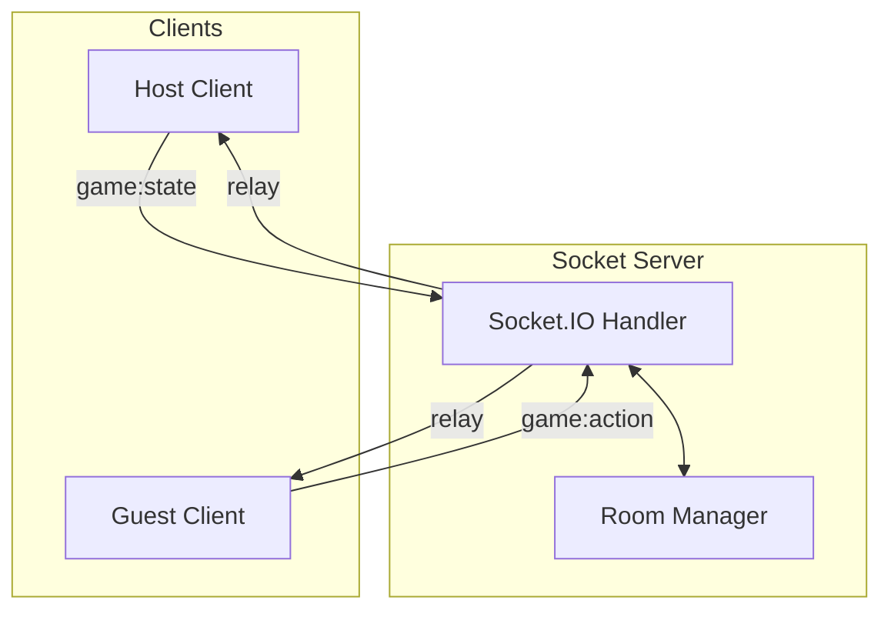

# GameHub Server

Real-time relay server using Socket.IO.

## Overview

The server acts as a **Pure Relay** (only forwards data):

- Room and player management
- Real-time chat system
- Action and state forwarding (no game logic)

---

## Architecture



### Core Concepts

1. **Pure Relay Pattern**: Server does not validate actions or store game state. Everything is processed on the Host Client.
2. **Spectator-First**: New players join as spectators. The Host manually adds them to a player slot to avoid disrupting ongoing games.
3. **Host Authority**: Rooms are deleted when the Host leaves (except for automatic recreation when Host reconnects).

---

## Development

```bash
cd server
bun install
bun run dev  # Runs on port 3001
```

### Environment Variables (.env)

| Variable | Description | Default |
|----------|-------------|---------|
| `PORT` | Server port | 3001 |
| `CLIENT_URL` | Frontend URL for CORS configuration | - |

---

## API & Events

### HTTP Endpoints

| Endpoint | Description |
|----------|-------------|
| `/health` | Health check |
| `/stats` | Online users and room count |

### Socket Events

| Category | Events |
|----------|--------|
| Room | `room:create`, `room:join`, `room:update` |
| Game | `game:action`, `game:state`, `game:state:patch` |

See the source code for detailed event payloads.
